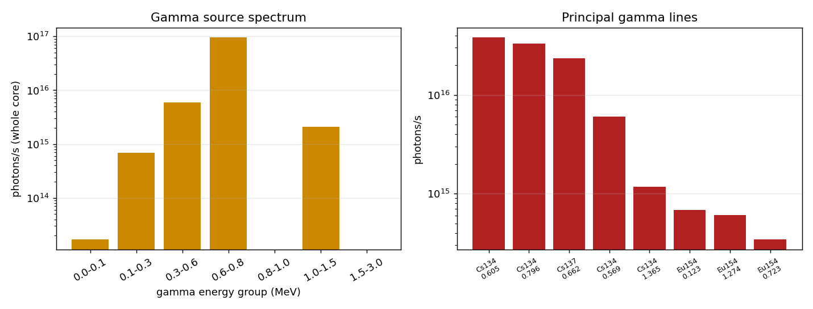

# Spent-fuel gamma & neutron source term for shielding / layout (FER §8.11 #7) — generated

- Generated: `2026-06-05T18:06:40.983943+00:00`
- Source: OpenMC discharge inventory (whole 21-FA core, 42.8 GWd/t). Produced by [NEU]; shielding/layout use by [LAY].
- **Estimate tier** (Windows): SF neutrons + principal-line gammas of the governing emitters. Valid as a first-order source term for **~5+ yr cooling** (dry-cask / ISFSI layout); a lower bound at short cooling.

## Neutron source (spontaneous fission)

| Nuclide | n/s (core) | share |
|---|---|---|
| Cm244 | 2.963e+09 | 99.2% |
| Pu240 | 1.390e+07 | 0.5% |
| Pu242 | 6.142e+06 | 0.2% |
| Pu238 | 3.904e+06 | 0.1% |
| Pu239 | 6.308e+02 | 0.0% |
| Pu241 | 3.849e+02 | 0.0% |
| **Total** | **2.987e+09 n/s** | (~1.42e+08 n/s per assembly) |

- Mean SF neutron energy ~2.0 MeV (Watt-like) for neutron-shield sizing.
- **Cm-244 dominates** the neutron field — the key driver of cask neutron shielding and stand-off. **(α,n)** in the oxide adds a secondary term (needs SOURCES4C / OpenMC; not included here).

## Gamma source

| Quantity | Value |
|---|---|
| Total photon emission | **1.040e+17 photons/s** (4.95e+15 per FA) |
| Gamma energy rate | 7.152e+16 MeV/s = **1.15e+04 W** |
| Mean photon energy | 0.687 MeV |

Principal lines (photons/s, whole core):

| Nuclide | E (MeV) | photons/s |
|---|---|---|
| Cs134 | 0.6047 | 3.809e+16 |
| Cs134 | 0.7958 | 3.321e+16 |
| Cs137 | 0.6617 | 2.362e+16 |
| Cs134 | 0.5693 | 6.009e+15 |
| Cs134 | 1.3650 | 1.171e+15 |
| Eu154 | 0.1232 | 6.872e+14 |
| Eu154 | 1.2745 | 6.038e+14 |
| Eu154 | 0.7232 | 3.436e+14 |

- The **0.662 MeV Cs-137** and **0.6-0.8 MeV Cs-134** lines carry the penetrating gamma load → set the cask/pool gamma-shield thickness. Am-241 0.059 MeV is soft (self-shielded). Cs-134 (T½ 2.1 yr) decays away over the first decade, so the gamma field eases with cooling.

## Shielding / layout read-out

| Driver | Value | Use |
|---|---|---|
| Gamma source | 1.04e+17 ph/s (0.69 MeV avg) | gamma wall thickness |
| Neutron source | 2.99e+09 n/s | neutron shield + stand-off |
| n / gamma ratio | 2.87e-08 | mixed-field weighting |
| Per assembly | 4.95e+15 ph/s, 1.42e+08 n/s | single-cask basis |



## Rigorous extraction (OpenMC, WSL — for the final/appendix numbers)

```
# from the core depletion results, at each cooling time:
results = openmc.deplete.Results('08_depletion_baseline/depletion_results.h5')
mats = results.export_to_materials(last_step)      # depleted compositions
# decay to cooling time t (zero-flux IndependentOperator, see run_decay_heat.py)
openmc.config['chain_file'] = chain
src = mat.get_decay_photon_energy()                # photons/s + full spectrum
# neutron: SF from nuclide yields (+ (alpha,n) via SOURCES4C)
```
This returns the **full** decay-photon spectrum (all emitters, all lines) at each cooling time — superseding the principal-line estimate above and giving the Digital-Appendix-grade gamma source. The neutron SF total here is already representative; add (α,n) for completeness.

## Notes

- Whole-core values; divide by 21 for per-assembly (single-cask) or scale to the chosen cask loading.
- Activities are at the inventory reference time; short-lived emitters (Ce-144/Ru-106/Eu-155 etc.) not in the curated set raise the gamma field at <5 yr cooling — use the OpenMC spectrum there.
- Cite: ANSI/ANS-6.1.1 (gamma) and shielding standards for the dose conversion in §8.11/§8.10.
