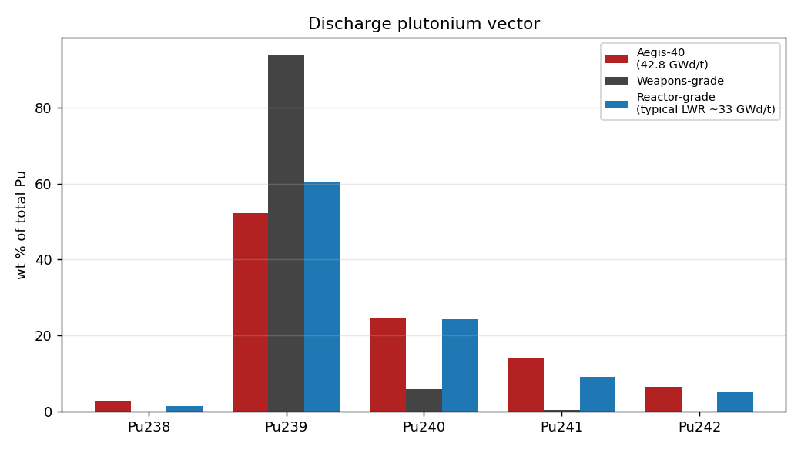
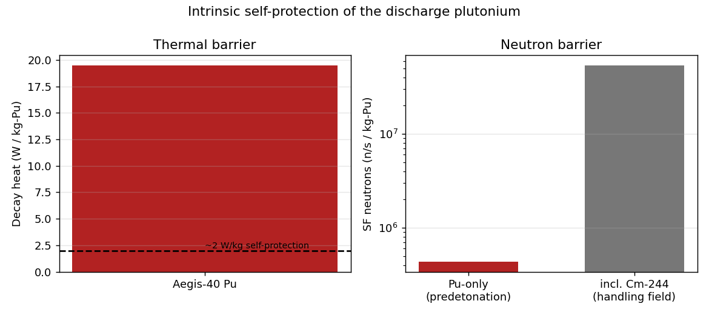
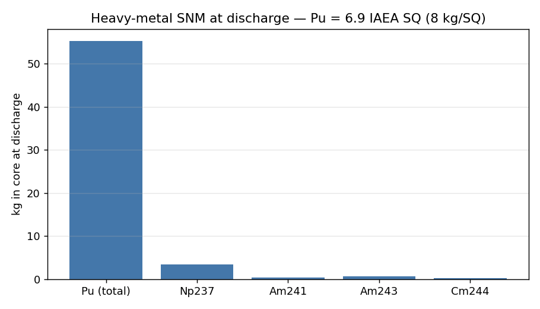

# Safeguards & non-proliferation — attractiveness of discharge materials (FER 3S, §8.5/§8.7)

- Generated: `2026-06-05T17:55:58.586258+00:00`
- Source inventory: `docs\competition\waste\discharge_inventory.csv` (whole-core discharge, 42.8 GWd/t, OpenMC depletion). Produced by [NEU]; framing by [3S].
- Basis: whole 21-FA core at discharge; per-batch = /4 (4-batch reload).

## 1. Plutonium vector and grade

| Isotope | grams | wt % of Pu |
|---|---|---|
| Pu238 | 1,507 | 2.72 |
| Pu239 | 28,935 | 52.29 |
| Pu240 | 13,623 | 24.62 |
| Pu241 | 7,697 | 13.91 |
| Pu242 | 3,571 | 6.45 |
| **Total Pu** | **55,334 g (55.3 kg)** | 100.00 |

- **Grade: REACTOR-GRADE** (Pu-240 = 24.6 wt%; weapons-grade is <7%, reactor-grade is >19%).
- Fissile fraction (Pu-239+Pu-241): **66.2%** (weapons-grade Pu-239 alone is >93%).
- High burnup pushes Pu-239 down to 52% and Pu-240/Pu-241/Pu-238 up — *more* degraded than a typical 33 GWd/t LWR discharge.

## 2. Intrinsic self-protection barriers

| Barrier | Value | Significance |
|---|---|---|
| Decay heat | **19.5 W/kg-Pu** (1076 W total) | ≫ ~2 W/kg 'self-protection' level; heat damages a device |
| SF neutrons (Pu metal) | **4.33e+05 n/s/kg-Pu** | predetonation background (Pu-240/238/242) |
| SF neutrons incl. Cm-244 | 5.40e+07 n/s/kg | Cm-244 dominates the spent-fuel handling field |

## 3. Spent uranium (non-attractive)

- U-235 at discharge: **1.10 wt%** — far below the 20% LEU/HEU line and the ~90% weapons line. The recovered uranium is **not** a usable enrichment.

## 4. Significant-quantity accounting (IAEA, Pu = 8 kg/SQ)

- Whole-core Pu: 55.3 kg = **6.9 SQ**.
- Per discharge batch (1/4 core): 13.8 kg = **1.7 SQ** — but embedded in intensely radioactive intact assemblies.
- Minor actinides (kg): Np237 3.34, Am241 0.37, Am243 0.71, Cm244 0.27 — Np-237/Am are materials of safeguards interest but require reprocessing to separate.

## 5. Material-attractiveness FOM (Bathke) — INDICATIVE

Bathke FOM₁ = 1 − log₁₀[ M/800 + M·h/4500 + M·D/50 ] (M = bare critical mass kg, h = heat W/kg, D = dose rate rad/h at 1 m from 0.2·M). Higher FOM = more attractive; FOM₁ > 1 ≈ weapons-usable.

| Input | Value | Basis |
|---|---|---|
| M (bare critical mass) | ~13.8 kg | **indicative** — reciprocal-mass weighting of pure-isotope bare spheres |
| h (decay heat) | 19.5 W/kg | computed above (rigorous) |
| D (dose rate) | pending | needs the gamma-source calc (#7) |
| FOM₁ (heat+mass terms only) | **~2.11** | upper bound (no dose) |
| FOM₁ (with illustrative D=5 rad/h) | ~0.84 | dose lowers it |

**Honest interpretation (this is the FER-credible reading):** even at high burnup the reactor-grade Pu sits at FOM₁ ≈ 0.8–2.1, i.e. still nominally 'attractive' by the intrinsic metric — this is Bathke's own finding that heat/neutron penalties alone do **not** render separated Pu unusable. The decisive proliferation resistance is therefore **extrinsic**: the Pu is locked inside self-protecting, intensely radioactive intact spent-fuel assemblies (whole-assembly dose ≫ the 1 Gy/h self-protecting threshold), under IAEA safeguards, in a once-through cycle with no reprocessing. High burnup *adds* to the intrinsic barriers (heat, neutrons, degraded vector) on top of that.

## Plots

## Method notes & open items

- Decay-heat / SF-neutron / critical-mass constants are standard isotopic values (encoded in the script with sources).
- **Rigorous FOM refinement (small WSL follow-up):** compute the bare critical mass M of the *actual* Pu vector with an OpenMC bare-sphere k_eff search, and the dose rate D from the gamma source term (#7). Both only *lower* the FOM, so the qualitative conclusion is unchanged.
- Burnup-trajectory view (Pu-239 fraction vs burnup) is a further option — needs the per-step Pu vector from the core depletion h5 (WSL).
- Cite: Bathke et al., *Nucl. Technol.* 179 (2012) 5; Wu et al., *Int. J. Energy Res.* (2020); IAEA Safeguards Glossary (SQ).
